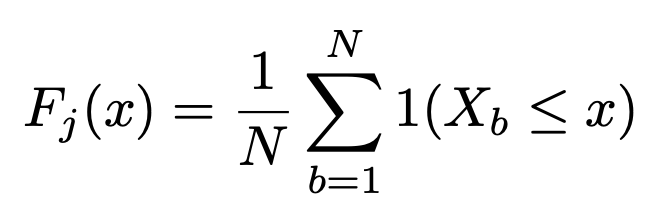
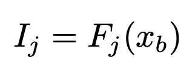
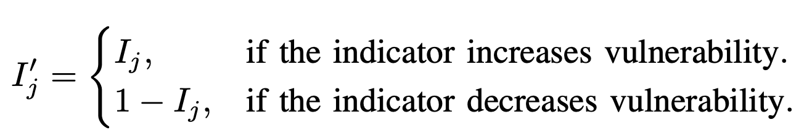
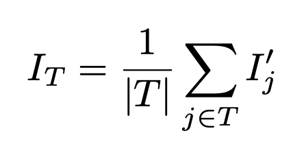
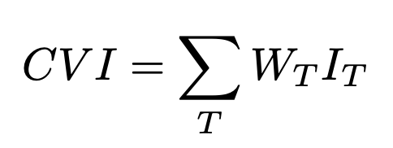

# Climate Ready Barcelona: Indicators calculation

Welcome to the **Climate Ready Barcelona: Indicators calculation** repository.

This repository contains a collection of Key Performance Indicators (KPIs) calculated for each building in the city of Barcelona.

These indicators are used to support data-driven decision-making and are displayed in the **Climate Ready BCN map**, a platform designed to visualize and explore urban performance metrics.

---

## Authors

- Jose Manuel Broto - jmbroto@cimne.upc.edu

- Gerard Mor - gmor@cimne.upc.edu

---

## Filling Missing KPI Values – KPI Predictor

To complement the static KPI dataset provided in this repository, we offer an additional tool: the [**KPI Predictor**](https://github.com/BeeGroup-cimne/CR_BCN_KPIs/tree/main/kpi_predictor), a Python-based utility that fills in missing KPI values over time using supervised learning techniques.

This tool is specifically designed to work with time series of KPIs stored in MongoDB and uses CatBoost, a gradient boosting model optimized for tabular data.

---
## KPI Documentation

This section provides a detailed list of Key Performance Indicators (KPIs) used to assess buildings and their surrounding environment in Barcelona. Each KPI includes its name, description, unit of measurement, and data source.

To improve clarity and usability, KPIs are grouped into the following typologies:

- **Building Characteristics**: Physical and structural features of buildings, such as floor area, construction year, number of dwellings, or wall orientation.

- **Climate Variability and Extreme Events**: Indicators that describe local climate behavior and exposure to extreme weather, including heatwaves, cooling degree days, and tropical nights.

- **Demographic Indicators**: Population characteristics such as age, gender, household size, and place of birth, allocated to each building.

- **Energy Indicators**: Information on energy consumption and efficiency, including electricity and gas use, thermal demand, and EPC performance.

- **Infrastructure Indicators**: Measures of access to climate shelters, vegetation coverage, and proximity to key infrastructure.

- **Socio-Economic Indicators**: Metrics describing income levels, economic inequality, and household income distribution.

### Building Characteristics

#### Average dwelling area

- **Description:** Average surface area of a dwelling, including both the private residential area and a proportional share of common spaces.
- **Unit:** m²
- **Data Source:** Spanish Cadastre.

#### Building code at time of construction

- **Description:** It identifies the building code at the time of a building's construction. Buildings are categorised based on the applicable regulatory framework, considering the legal standards at the time of construction rather than the year the regulations took effect. The classification includes different regulatory periods: buildings constructed before 1976 fall under the category SL (Sin Legislación), meaning there was no specific building code. Between 1977 and 1979, buildings followed the Technological Building Standards of Spain (NTE, from Normas Tecnológicas de la Edificación). From 1980 to 2005, the applicable framework was the Basic Building Standards (NBE, from Normas Básicas de la Edificación). In 2006, the Technical Building Code (CTE2006, from Código Técnico de la Edificación) was introduced, with its first version covering constructions from 2006 to 2012. The CTE was updated in 2013 (CTE2013), applying to buildings constructed between 2013 and 2018. The most recent version, in place since 2019 (CTE2019), applies to all constructions from that year onward.
- **Unit:** None
- **Data Source:** Spanish Cadastre.

#### Building roof area

- **Description:** Represents the total surface area of a building's roof, measured in square meters.
- **Unit:** m²
- **Data Source:** Spanish cadaster.

#### Number of dwellings per building

- **Description:** Indicates the total number of residential units (dwellings) within each building.
- **Unit:** u
- **Data Source:** Spanish cadaster.

#### Effective year of construcction by usage

- **Description:** Represents the adjusted construction year of a building, taking into account any major renovations or retrofitting that may have significantly altered its structure or energy performance. This metric provides a more accurate reflection of the building’s current condition rather than just its original construction date. The classification by usage helps differentiate how the building (e.g., residential, commercial, mixed-use) has evolved over time.
- **Unit:** 
- **Data Source:** Spanish cadaster.

#### Elevation above sea level

- **Description:** The vertical height of a building relative to mean sea level, measured in meters.
- **Unit:** m
- **Data Source:** Spanish Cadastre.

#### Total built area

- **Description:** The total built area of the property is the sum of the cadastral constructed area of its private portion plus the corresponding share of the common elements’ area.The cadastral constructed area of the private portion is the one included within the outer line of the perimeter walls of each unit that makes up the property, and, where applicable, the centerlines of the party walls, excluding the area of light wells. Balconies, terraces, porches, and other similar elements that are covered count as 50% of their area, unless they are enclosed on three of their four sides, in which case they count as 100%.In residential use, spaces with a height lower than 1.50 meters are not considered constructed area.The area of common elements attributed to each property is published in the SEC for informational purposes and is an approximate distribution of the total area of the common elements of the property among its individual units, solely for cadastral valuation purposes.
- **Unit:** m²
- **Data Source:** Spanish Cadastre.

#### Building usage

- **Description:** Indicates the usage category of each building, classified into the following types: residential, agriculture, industrial, commercial, public services, and unused. The values represent the percentage of each usage type (in m²) relative to the building's total floor area.
- **Unit:** m²
- **Data Source:** Spanish Cadaster and Instituto Nacional de Estadistica (INE).

#### Number of floors above ground

- **Description:** Represents the total number of floors in a building that are above ground level.
- **Unit:** u
- **Data Source:** Spanish Cadaster

#### Number of floors below ground

- **Description:** Represents the total number of floors in a building that are below ground level.
- **Unit:** u
- **Data Source:** Spanish Cadaster.

#### Percentatge by building usage

- **Description:** Shows the proportion of each usage type in a building, expressed as a percentage of the total floor area. Usage types include: residential, agriculture, industrial, commercial, public services, and unused.
- **Unit:** \%
- **Data Source:** Spanish Cadaster.

#### Wall types in building

- **Description:** Total area of walls based on their type and orientation.The labels represent both the cardinal directions (North, South, East, West) as well as specific wall properties that influence thermal behavior:N (North): Represents walls facing the north. These walls typically receive less direct sunlight throughout the day.NE (Northeast): Walls facing the northeast will receive morning sunlight, but less exposure during the afternoon. S (South): Represents walls facing the south. These walls tend to receive the most direct sunlight, particularly in the Northern Hemisphere.SE (Southeast): These walls are exposed to sunlight during the early morning to midday, but with less direct sun in the afternoon.  W (West): Walls facing west will receive afternoon sunlight, often contributing to higher solar heat gain in the later hours of the day. SW (Southwest): These walls receive sunlight in the afternoon and can experience high solar heat gain towards the evening.NW (Northwest): Walls facing northwest receive indirect light throughout the day, with minimal direct sunlight. Air Contact: Refers to walls that are in direct contact with outdoor air, influencing heat loss or gain, especially in terms of temperature variations. Adiabatic: These walls do not exchange heat with the surrounding environment, and thus their thermal performance is unaffected by external air temperature changes.
- **Unit:** m²
- **Data Source:** Spanish Cadastre.

#### Walls ratio by type

- **Description:** The percentage distribution of total wall surface area according to wall type and orientation. The labels reflect both cardinal directions and thermal behavior characteristics:N (North): Walls facing north, receiving minimal direct sunlight throughout the day. NE (Northeast): These walls get morning sun exposure but limited sunlight in the afternoon. E (East): Face the sunrise, typically warming up early in the day. SE (Southeast): Exposed to sunlight from morning to midday. S (South): Receive the most consistent and direct sunlight, especially in the Northern Hemisphere. SW (Southwest): Receive direct sunlight in the afternoon, contributing to increased heat gain. W (West): Walls that face west receive afternoon sun and can overheat late in the day. NW (Northwest): These walls receive low levels of direct sunlight. Air Contact: External walls in contact with outdoor air, which affects heat loss or gain. Adiabatic: Walls that do not exchange heat with their surroundings, thus unaffected by external temperature changes. Each type's ratio represents its share of the total wall surface area in the building.
- **Unit:** \%
- **Data Source:** Spanish Cadastre.

### Climate Variability and Extreme Events

#### Cooling degree days

- **Description:** Cooling Degree Days (CDD) are a measure of the cooling energy demand. For each day when the average outdoor temperature exceeds 23 °C, the difference between the average temperature and 23 °C is calculated. The total CDD indicates the extent of air conditioning or cooling required..
- **Unit:** ºC·day
- **Data Source:** Data was obtained from ERA5-Land (grid resolution of 8km between points). Then, a model was applied to downscale the data to a 100x100m resolution.

#### Heat index (daily average)

- **Description:** The number of days in a year with a heat index greater than a threshold. In this case, the average heat index during the day is considered. The index is calculated using the Lu and Romps model (Lu, Y. C., & Romps, D. M. (2022). Extending the heat index. *Journal of Applied Meteorology and Climatology*, 61(10), 1367-1383), which combines both temperature and humidity to reflect how intense the heat feels. The results are classified into the following categories:Safe: Below 27ºC.Caution: 27ºC to 33ºC.Extreme Caution: 33ºC to 41ºC.Hazardous: 41ºC to 52ºC.Extreme Hazardous: 52ºC to 92ºC.Beyond Human Limit: Above 92ºC.
- **Unit:** days/year
- **Data Source:** Data was obtained from ERA5-Land (grid resolution of 8 km between points). Then, a machine learning model was applied to downscale the data to a 100 x 100 m resolution. The heat index limits were defined by the NWS (National Weather Service of the USA) and Lu and Romps (2022).

#### Heat index (daily maximum)

- **Description:** The number of days in a year with a heat index greater than a threshold. In this case, the maximum heat index during the day is considered. The index is calculated using the Lu and Romps model (Lu, Y. C., & Romps, D. M. (2022). Extending the heat index. *Journal of Applied Meteorology and Climatology*, 61(10), 1367-1383), which combines both temperature and humidity to reflect how intense the heat feels. The results are classified into the following categories:Safe: Below 27ºC.Caution: 27ºC to 33ºC.Extreme Caution: 33ºC to 41ºC.Hazardous: 41ºC to 52ºC.Extreme Hazardous: 52ºC to 92ºC.Beyond Human Limit: Above 92ºC.
- **Unit:** days/year
- **Data Source:** Data was obtained from ERA5-Land (grid resolution of 8 km between points). Then, a machine learning model was applied to downscale the data to a 100 x 100 m resolution. The heat index limits were defined by the NWS (National Weather Service of the USA) and Lu and Romps (2022).

#### Heatwaves

- **Description:** It counts the number of days during a heatwave in a year. A heatwave is defined as a period of at least three consecutive days in which the heat index remains above 33°C at all times, without dropping below this threshold at any moment of the day or night.
- **Unit:** days/year
- **Data Source:** Data was obtained from ERA5-Land (grid resolution of 8km between points). Then, a model was applied to downscale the data to a 100x100m resolution. The method for calculating the heat index is the Lu and Romps model.

#### Heating Degree Days

- **Description:** Heating Degree Days (HDD) are a metric used to estimate heating energy demand. For each day when the average outdoor temperature is below 18 °C, the difference between 18 °C and the average temperature is calculated. These daily values are summed over a period to assess overall heating needs.
- **Unit:** ºC·day
- **Data Source:** Data was obtained from ERA5-Land (grid resolution of 8km between points). Then, a model was applied to downscale the data to a 100x100m resolution.

#### Torrid nights

- **Description:** It counts the total number of nights in a year when the temperature remains between 25.1°C and 30°C throughout the entire night. A 'night' is defined as the period from 19:00 to 06:59. Only nights where the temperature does not drop below 25.1°C are included in this count.
- **Unit:** days/year
- **Data Source:** Data was obtained from ERA5-Land (grid resolution of 8km between points). Then, a model was applied to downscale the data to a 100x100m resolution.

#### Tropical nights

- **Description:** It counts the total number of nights in a year when the temperature remains between 20.1°C and 25°C throughout the entire night. A 'night' is defined as the period from 19:00 to 06:59. Only nights where the temperature does not drop below 20.1°C are included in this count.
- **Unit:** days/year
- **Data Source:** Data was obtained from ERA5-Land (grid resolution of 8km between points). Then, a model was applied to downscale the data to a 100x100m resolution.

### Demographic Indicators

#### Ancients per building

- **Description:** Estimates the number of elderly residents (aged 65 and older) living in a specific building. This metric is derived from demographic data provided by INE at the census tract level. The allocation to individual buildings is performed proportionally based on the number of dwellings in each building.
- **Unit:** u/dwelling
- **Data Source:** Instituto Nacional de Estadística (INE) and Spanish Cadastre.

#### Residents' birthplace

- **Description:** Birthplace of residents living in a building. It categorizes the population based on their country or region of birth. This metric is derived from demographic data provided by the INE at the census tract level. The allocation to individual buildings is performed proportionally based on the size of the dwellings.
- **Unit:** \%
- **Data Source:** Instituto Nacional de Estadística (INE) and Spanish Cadaster.

#### Children per building

- **Description:** Estimates the number of children (aged 14 and younger) living in a specific building. This metric is derived from demographic data provided by the INE at the census tract level. The allocation to individual buildings is performed proportionally based on the number of dwellings in each building.
- **Unit:** u/dwelling
- **Data Source:** Instituto Nacional de Estadística (INE) and Spanish Cadastre.

#### Number of females

- **Description:** Estimates the number of female residents living in a specific building. This metric is derived from demographic data provided by the INE at the census tract level. The allocation to individual buildings is performed proportionally based on the number of dwellings in each building.
- **Unit:** u/dwelling
- **Data Source:** Instituto Nacional de Estadística (INE) and Spanish Cadastre.

#### Number of males 

- **Description:** Estimates the number of male residents living in a specific building. This metric is derived from demographic data provided by the INE at the census tract level. The allocation to individual buildings is performed proportionally based on the number of dwellings in each building.
- **Unit:** u/dwelling
- **Data Source:** Instituto Nacional de Estadística (INE) and Spanish Cadastre.

#### Percentage of population over 65

- **Description:** Measures the proportion of individuals over the age of 65 within a given building. This metric is derived from demographic data provided by the INE at the census tract level. The allocation to individual buildings is performed proportionally based on the number of dwellings in each building.
- **Unit:** \%
- **Data Source:** Instituto Nacional de Estadística (INE) and Spanish Cadaster.

#### Percentage of population under 18

- **Description:** Measures the proportion of individuals under the age of 18 within a given building. This metric is derived from demographic data provided by the INE at the census tract level. The allocation to individual buildings is performed proportionally based on the number of dwellings in each building.
- **Unit:** \%
- **Data Source:** Instituto Nacional de Estadística (INE) and Spanish Cadaster.

#### Percentage of single-person hosusehold

- **Description:** Measures the share of households occupied by a single person. This metric is derived from demographic data provided by the INE at the census tract level. The allocation to individual buildings is performed proportionally based on the number of dwellings in each building.
- **Unit:** %
- **Data Source:** Instituto Nacional de Estadística (INE) and Spanish Cadaster.

#### Number of residents

- **Description:** Represents the estimated number of residents living in a specific building. This metric is derived from demographic data provided by the INE at the census tract level. The allocation to individual buildings is performed proportionally based on the number of dwellings in each building.
- **Unit:** u/dwelling
- **Data Source:** Instituto Nacional de Estadística (INE) and Spanish Cadaster.

### Energy Indicators

#### Annual electricity consumption

- **Description:** Represents the total amount of electricity consumed over the course of one year within a specific building, expressed in kilowatt-hours per square meter (kWh/m²). This metric is used to track energy efficiency in relation to the building’s size. The calculation considers the total surface area of the building, including common areas and any commercial premises that may exist on the ground floor.
- **Unit:** kWh/m²
- **Data Source:** ENDESA and Metropolitan Area of Barcelona (AMB).

#### Annual gas consumption

- **Description:** Represents the total amount of gas consumed over the course of one year within a specific building, expressed in kilowatt-hours per square meter (kWh/m²). This metric is used to assess energy efficiency by comparing gas consumption to the building's size. The calculation considers the total surface area of the building, including common areas and any commercial premises that may exist on the ground floor.
- **Unit:** kWh/m²
- **Data Source:** NEDGIA, Metropolitan Area of Barcelona (AMB) and Spanish cadaster

#### Cooling Thermal Demand Intensity

- **Description:** It quantifies the amount of energy required for cooling a building in relation to its surface area. Higher values indicate a greater cooling demand, which may result from poor thermal insulation, high solar gains, or inefficient cooling systems. Lower values suggest better thermal performance due to passive design strategies, effective insulation, or natural ventilation.
- **Unit:** kWh/m²
- **Data Source:** Energy Performance Certificates.

#### Heating Thermal Demand Intensity

- **Description:** It quantifies the amount of energy required for heating a building in relation to its surface area. Higher values indicate a greater heating demand, which may result from poor thermal insulation, high heat losses, or inefficient heating systems. Lower values suggest better thermal performance due to passive design strategies, effective insulation, or optimized heat retention.
- **Unit:** kWh/m²
- **Data Source:** Energy Performance Certificates.

#### Primary Energy from EPCs

- **Description:** It quantifies the total primary energy demand of a building as stated in its official energy performance certificate. This value, includes both the direct energy consumption of the building and the energy losses associated with generation, transmission, and distribution. It serves as a standardized metric for assessing the energy efficiency of buildings.
- **Unit:** kWh/m²
- **Data Source:** Energy Performance Certificates.

#### Total Energy Demand Intensity 

- **Description:** It quantifies the total primary energy demand of a building as stated in its official energy performance certificate. This value, includes both the direct energy consumption of the building and the energy losses associated with generation, transmission, and distribution. It serves as a standardized metric for assessing the energy efficiency of buildings.
- **Unit:** kWh/m²
- **Data Source:** Energy Performance Certificates.

#### Window-to-Wall Ratio

- **Description:** It quantifies the ratio of the total window area to the total wall area of a building. This KPI is expressed as a dimensionless ratio, and it provides insight into the building’s thermal performance, daylighting potential, and potential solar gains. Higher values indicate greater window coverage relative to wall area, which may impact energy efficiency, comfort, and solar heat gain.
- **Unit:** N/A
- **Data Source:** Energy Performance Certificates.

#### Yearly electricity consumption profile

- **Description:** It provides a detailed view of the electricity usage over the course of a full year. It tracks how much electricity is consumed each month, showing the peaks and valleys in consumption, and identifying any patterns or seasonal changes.
- **Unit:** kWh/m²
- **Data Source:** ENDESA and Metropolitan Area of Barcelona (AMB).

### Infrastructure Indicators

#### Minimum time to nearest climate shelter

- **Description:** This indicator measures the estimated minimum time it takes for a person to reach the nearest climate shelter from a specific location, using the available pedestrian network.
- **Unit:** min
- **Data Source:** Open Data Portal of the Barcelona City Council.

#### Number of Climate Shelters within X minutes

- **Description:** It tracks the number of climate shelters accessible within a specified timeframe (10, 15, 20, or 30 minutes) from each building.
- **Unit:** u
- **Data Source:** Open Data Portal of the Barcelona City Council.

#### Vegetation index

- **Description:** The vegetation index represents the level of vegetation coverage around a building, classified into five categories based on the Normalized Difference Vegetation Index (NDVI). The category darker corresponds to an NDVI value lower than 0.0 and represents water bodies or artificial surfaces such as roads and concrete.  The category dark corresponds to an NDVI value between 0.0 and 0.2 and indicates bare soil or dead vegetation.  The category medium corresponds to an NDVI value between 0.2 and 0.4 and represents shrubland or grassland.  The category light corresponds to an NDVI value between 0.4 and 0.6 and indicates abundant and vigorous vegetation.  The category lighter corresponds to an NDVI value greater than 0.6 and represents areas with very dense and healthy vegetation.
- **Unit:** \%
- **Data Source:** Institut Cartogràfic i Geològic de Catalunya (ICGC) and spanish cadaster

#### Vegetation Index Average

- **Description:** The Vegetation Index Average is the average NDVI value calculated across the five vegetation categories: darker, dark, medium, light, and lighter. This KPI provides an overall measure of vegetation coverage around a building (10m), offering a general overview of the environmental conditions in terms of vegetation health and density.
- **Unit:** 
- **Data Source:** Institut Cartogràfic i Geològic de Catalunya (ICGC) and spanish cadaster

### Socio-Economic Indicators

#### Annual Net Household Income

- **Description:** The average annual net income per household, expressed in euros, represents the total income that households receive over the course of a year after taxes and social contributions have been deducted. This figure provides an essential indicator of the economic well-being of residents within a given area, allowing for comparisons between different regions, socioeconomic groups, and time periods.
- **Unit:** €/year
- **Data Source:** INE (National Statistics Institute)

#### Income Gini Index

- **Description:** The income Gini index measures inequality in income distribution within a population. A value of 0 indicates perfect equality, while a value of 1 represents total inequality, where one individual holds all the income. This indicator is commonly used to assess the level of economic equity in a region or country. This metric is derived from socio-economic data provided by the INE at the census tract level. The allocation to individual buildings is performed proportionally based on the number of people livinc in each building.
- **Unit:** \%
- **Data Source:** Instituto Nacional de Estadística (INE) and Spanish Cadaster.

#### Income distribution P80/P20

- **Description:** Measures the disparity between the income of the 80th percentile (P80) and the 20th percentile (P20) of a given population. This metric indicates the level of income inequality by comparing the income of the top 20% to the bottom 20%. The higher the ratio, the greater the income inequality, suggesting that the wealthiest individuals earn significantly higher incomes compared to the poorest. This metric is derived from demographic data provided by the INE at the census tract level. The allocation to each building is done proportionally based on the number of residential dwellings in each building.
- **Unit:** None
- **Data Source:** Instituto Nacional de Estadística (INE) and Spanish Cadastre.

---

## Climate Vulnerability Index (CVI) construction

The **Climate Vulnerability Index (CVI)** is a composite indicator used to assess climate-related vulnerability across buildings in Barcelona. To assign a vulnerability value to each building for a given indicator, an **Empirical Cumulative Distribution Function (ECDF)** is used. The ECDF transforms raw indicator values into a continuous score between 0 and 1, representing the building’s relative position within the city-wide distribution. This allows for a finer-grained assessment than discrete quantile bins.
Indicators are grouped into thematic categories, and each category contributes equally to the initial index — which is the default version shown on the Climate Ready BCN map. However, users can adjust the weights of these categories to reflect specific local priorities or sensitivities.

### CVI categories and included KPIs:
- **Demographic Indicators**: Number of child residents, number of elderly residents, number of female residents.
- **Building Characteristics Indicators**: Total built area, year of construction.
- **Climate Variability and Extreme Events Indicators**: Torrid nights, heat index.
- **Energy Indicators**: Annual electricity consumption, annual gas consumption, cooling thermal demand (EPC), heating thermal demand (EPC), and final energy consumption (EPC).
- **Socio-Economic Indicators**: Annual net household income, income Gini index.

**Note:** Some indicators are considered *inverse*, meaning that higher values contribute to *lower* vulnerability. These include: total built area, year of construction, and annual net household income.
### Mathematical formulation:
Mathematically, for an indicator *I*, the ECDF is defined as:

Where:
- **N** is the total number of buildings
- **Xᵦ** is the indicator value for building *b*
- **1(Xᵦ ≤ x)** is an indicator function returning 1 if the condition is true, 0 otherwise

For an indicator *Iⱼ* of a building *b*, the normalized value becomes:

Some indicators *reduce* vulnerability (e.g., high income, newer buildings). These are treated as inverse indicators, and their scores are flipped:

Where *Iⱼ* is the value between 0 and 1 of indicator *j*.
Each indicator belongs to a broader typology (category), and the **typology score** is computed as the average of its indicators:

Where |T| is the number of indicators in typology T.

Finally, the **Climate Vulnerability Index (CVI)** is calculated as a weighted sum of all typologies:

Where **Wₜ** is the weight assigned to typology T.

By default, all typologies are equally weighted (Wₜ = 1/7). However, the user interface allows for customization of these weights, enabling users to prioritize indicators based on their specific needs — such as focusing more on climatic factors or socioeconomic vulnerability.

The figure below shows a spatial representation of the CVI across Barcelona:

The figure above illustrates the vulnerability levels of buildings throughout the city, with areas of higher vulnerability marked. On the left-hand side of the map, the different indicator typologies are displayed, and users can adjust the weights of these categories.
This customisation feature allows users to modify the influence of each typology (such as demographic, building characteristics, or energy-related indicators) based on their specific needs or priorities. By adjusting these weights, users can tailor the analysis to focus more on certain factors — for instance, prioritising climate-related variables or socioeconomic factors — depending on the context or objectives of their study.

---

## License

This project is licensed under the **European Union Public License (EUPL), Version 1.2.**

You may obtain a copy of the license at:

https://joinup.ec.europa.eu/collection/eupl/eupl-text-eupl-12

Unless required by applicable law or agreed to in writing, software distributed under this license is distributed **on an "AS IS" basis**, without warranties or conditions of any kind.

© 2025 Jose Manuel Broto, Gerard Mor

Thank you for using Climate Ready Barcelona: Indicators calculation!

For any questions or suggestions, feel free to reach gmor@cimne.upc.edu
